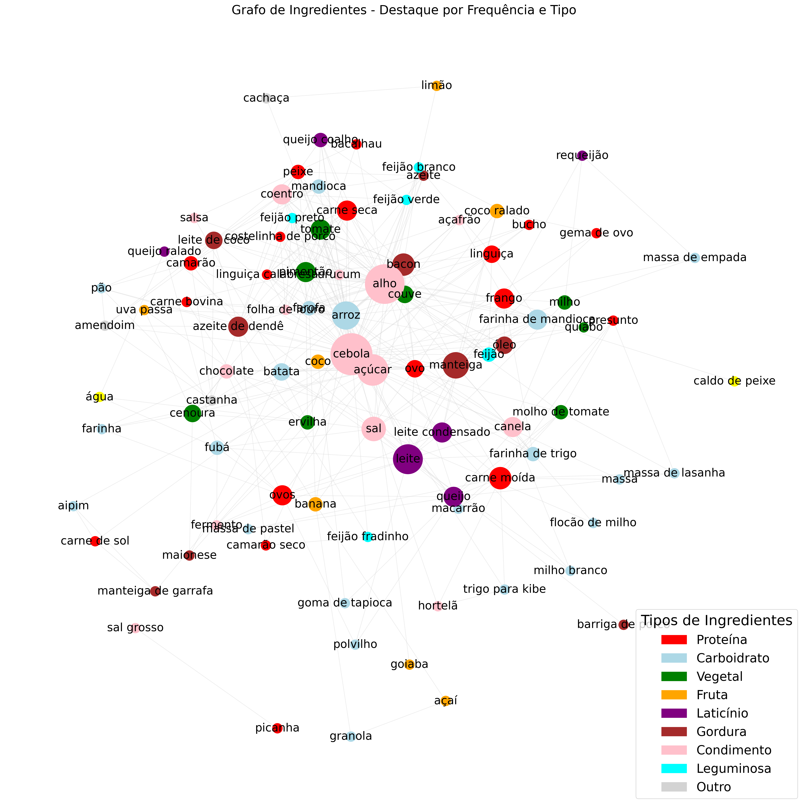

# Análise de Assortatividade em Grafos de Ingredientes da Culinária Brasileira

### Maria Eduarda Lima da Luz  
**Matrícula:** 20250051776 
**Curso:** Engenharia da Computação - UFRN

---

## 🎯 Descrição da Tarefa

Este projeto tem como objetivo realizar uma análise de **assortatividade** em grafos, aplicando o conceito sobre ingredientes de 51 receitas típicas da culinária brasileira.

O trabalho envolveu:
- Coleta e organização dos dados com auxílio de uma **LLM (ChatGPT 4.0)**.
- Construção de um grafo de co-ocorrência de ingredientes utilizando **NetworkX**.
- Cálculo do **coeficiente de assortatividade** com base nos tipos de ingredientes.
- Geração de visualizações e análises complementares.

🎥 **Vídeo de Apresentação:** https://youtu.be/MFfm7QHW9dQ

---

## 🤖 Uso da LLM (ChatGPT 4.0)

Para identificar os ingredientes e classificá-los, utilizei o modelo de linguagem **ChatGPT 4.0** com o seguinte prompt:

O prompt solicitava a identificação do nome da receita, a lista de ingredientes principais e a classificação de cada ingrediente em categorias pré-definidas, conforme exigido pela tarefa.

As respostas foram organizadas no arquivo `Ingredientes.csv`, que serviu como base para a construção do grafo e as análises posteriores.

---

## 📊 Discussão dos Principais Achados

O grafo construído a partir das receitas revelou padrões interessantes na combinação de ingredientes da culinária brasileira. O **coeficiente de assortatividade** obtido foi **-0.0756**, indicando uma leve tendência à **heterofilia**, ou seja, uma preferência por combinar ingredientes de tipos diferentes (como proteínas com carboidratos, vegetais com condimentos, etc.).

Essa tendência reflete a diversidade gastronômica do Brasil, onde os pratos típicos são caracterizados por misturas equilibradas de diferentes categorias de ingredientes.

Além disso, a análise revelou:
- Ingredientes "hub", como **cebola**, **alho** e **arroz**, que aparecem com alta frequência em várias receitas.
- A predominância de categorias como **carboidratos**, **condimentos** e **proteínas** no grafo.
- A forte representatividade de estados como **Bahia**, **Minas Gerais** e **São Paulo** na origem das receitas.

---

## 🖼️ Visualização do Grafo

---

## 📂 Estrutura do Repositório

- `Ingredientes.csv` — Base de dados organizada.
- `Ingredientes.ipynb` — Notebook com todas as etapas da análise.
- `ingrediente_tipo_manual.py` — Dicionário de Classificação dos Ingredientes.
- `/imagens` — Pasta contendo as visualizações geradas.
- `llm_info.md` — Detalhamento do uso da LLM e dos prompts aplicados.
- `README.md` — Descrição do projeto e discussão dos resultados.

---

> Projeto desenvolvido para a disciplina de  Algoritmos e Estrutura de Dados 2 - UFRN
